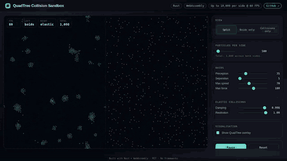
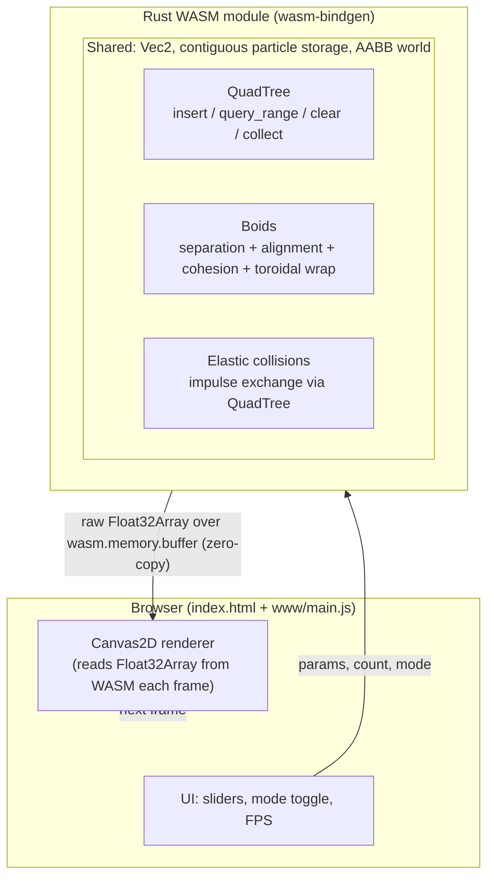
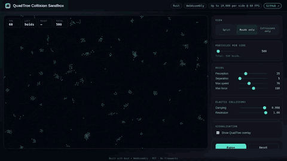
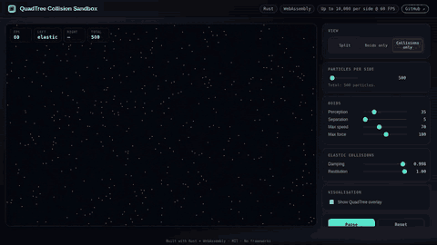

# QuadTree Collision Sandbox

> **Boids flocking and elastic-collision physics in the browser, accelerated by a dynamic QuadTree. Up to 10,000 particles per side; 60 FPS up to 5,000.**

[](LICENSE)
[](https://www.rust-lang.org)
[](https://webassembly.org)
[](https://github.com/rustwasm/wasm-pack)
[](https://deadlici0us.github.io/Quadtree-Collision/)

[**Live demo →**](https://deadlici0us.github.io/Quadtree-Collision/)



A two-in-one physics sandbox built in Rust and compiled to WebAssembly. The default landing page is a **split canvas**: boids flocking on the left, elastic-collision particles on the right — 500 + 500 agents, all live in your browser. Toggle to single mode for the full canvas with up to 10,000 of either simulation.

---

## Features

- **Boids flocking** with separation, alignment, and cohesion rules.
- **Elastic particle collisions** with positional correction and equal-mass impulse exchange.
- **Split-view default**: boids (left) + collisions (right), 500 + 500.
- **Single-view mode**: up to 10,000 agents in either simulation.
- **Toroidal wrap with edge awareness**: a 3×3 wrap-shift in the boid perception query means edge boids still see the neighbours that physically wrap to the other side — no more flocking collapse at the world boundary.
- **Dynamic QuadTree** spatial index, rebuilt per frame. Capacity 8, max depth 8.
- **QuadTree debug overlay** to visualise the spatial subdivision live.
- **Full control panel**: particle count (100–10,000 per side, step 100), perception radius, separation radius, max speed, max force, damping, restitution, pause/reset.
- **Rolling-average FPS HUD**.
- **Zero-copy** position readback: WASM exposes a raw `Float32Array` over its own linear memory; JS wraps it without an additional copy.
- **No frameworks**: vanilla JS + Canvas2D. The whole binary is ~40 KB of WASM.

---

## Tech

- **Rust 1.75+** with `wasm-bindgen` 0.2 and `js-sys` 0.3.
- **wasm-pack 0.15** for the build pipeline.
- **No JavaScript bundler** — the page is a single `index.html` that imports the generated `pkg/quadtree_collision.js` as an ES module.
- **No CSS framework** — one hand-written `www/style.css`.
- **47 unit + integration tests** for the math primitives, Rect, QuadTree (incl. a 50k-point brute-force parity stress test), boids rules, elastic collisions, and the WASM sandbox surface.

---

## Why it matters

The headline optimization is replacing the brute-force neighbour check with a per-frame-rebuilt **dynamic QuadTree**.

Measured with `cargo bench` (Criterion 0.5) on a single core, full neighbour-query sweep over all `n` particles:

| n particles | Brute-force query | QuadTree query | Speedup |
| ----------- | ----------------: | -------------: | ------: |
| 100         |          0.021 ms |       0.007 ms |    2.9× |
| 500         |          0.518 ms |       0.097 ms |    5.3× |
| 1,000       |          2.085 ms |       0.378 ms |    5.5× |
| 2,000       |          8.359 ms |       1.232 ms |    6.8× |
| 5,000       |         51.67  ms |       6.22  ms |    8.3× |
| 10,000      |        205.68  ms |      21.19  ms |    9.7× |

A 60 FPS budget is 16.6 ms per frame. The slider's max of 10,000 per side is chosen so the full collisions step (QT rebuild + resolve + integrate + bounce) finishes in ~8 ms — comfortably under the budget at the slider max. The QuadTree is faster than brute force at every n tested; the speedup ratio is ~3× at small n (constant overhead) and grows toward 10× as n climbs. Full benchmark numbers live in [`docs/benchmarks.md`](docs/benchmarks.md).

A single tree, fully rebuilt every frame, is faster than incremental updates for a moving field because:

1. The amortised cost of full rebuilds is lower than tracking per-entry moves across a deep tree.
2. Memory stays hot — child boxes are kept alive between frames via `QuadTree::clear`.
3. No per-frame allocation in the hot path. A single scratch `Vec<u32>` is reused.

---

## Architecture



The data flow is: particles move → new AABBs → rebuilt QuadTree → per-particle neighbour query → updated velocities → updated positions → positions buffer → JS reads via `Float32Array` over `wasm.memory.buffer` → Canvas2D `fillRect` per particle.

---

## What is a QuadTree and why is it faster?

A **QuadTree** is a 2D spatial index: a tree where every node covers an axis-aligned region of the plane, and any node that holds more than a small number of points splits itself into four equal child quadrants (NW, NE, SW, SE). The split recurses up to a fixed max depth, producing a hierarchy of nested boxes that adapt to where the points actually are. Empty areas stay as a single big box; dense areas get subdivided until the points are grouped into tight leaves.

The operation that matters for this sandbox is **range query**: "give me every point inside this rectangle". A naive brute-force loop scans *all* `n` points and costs **O(n)** per query. The QuadTree answers the same query by walking only the nodes whose AABB intersects the query rect, so it skips entire subtrees that don't overlap. The cost becomes roughly **O(k · log n)**, where `k` is the number of points actually returned — i.e. proportional to what you found, not to the total population. For neighbour lookups around a particle that only sees a handful of nearby points, `k` is tiny even when `n` is 10,000.

The flip side is the rebuild cost: in a moving simulation, points drift, so the tree has to be reinserted every frame. That's why this implementation keeps the same node allocations alive across frames (`clear()` empties the entries but keeps the four child boxes), so a frame's rebuild is just a re-bucket — no allocator traffic in the hot path. Full rebuilds per frame beat incremental move-tracking for moving fields because the amortised cost is lower and the memory stays hot.

The net effect, measured with Criterion on a full neighbour sweep, is summarised in the table above; full numbers are in [`docs/benchmarks.md`](docs/benchmarks.md).

---

## Quick start

### Prerequisites

- Rust 1.75+ (install via [rustup](https://rustup.rs))
- `wasm32-unknown-unknown` target
- `wasm-pack`

```bash
rustup target add wasm32-unknown-unknown
cargo install wasm-pack
```

### Build

```bash
wasm-pack build --release --target web --out-dir pkg
```

This produces `pkg/quadtree_collision.js` and `pkg/quadtree_collision_bg.wasm` (≈ 40 KB).

### Serve

Any static file server works. The repo includes an example Python one-liner:

```bash
python3 -m http.server 8080
# then open http://localhost:8080/
```

> **Note**: `SharedArrayBuffer` is not required, but the page does work with the `Cross-Origin-Embedder-Policy: require-corp` / `Cross-Origin-Opener-Policy: same-origin` headers for stricter environments. The `docs/capture.mjs` script sets these.

### Test

```bash
cargo test
```

47 tests covering: `Vec2` algebra, `Rect` containment and partitioning, QuadTree insert/query/clear/stress, particle storage and wrap/bounce, boids rule directions, elastic momentum conservation, and the WASM `Sandbox` surface (single mode, split mode, 600-step NaN guard).

---

## Configuration

The `Sandbox` struct exposes a `set_param(name, value)` for tuning the live simulation:

| `name`              | Effect                                  | Default |
| ------------------- | --------------------------------------- | ------: |
| `perception`        | Boids neighbour radius (px)             |    35.0 |
| `separation_radius` | Boids separation trigger radius (px)    |     5.0 |
| `w_sep`             | Separation force weight                 |     1.8 |
| `w_ali`             | Alignment force weight                  |     1.0 |
| `w_coh`             | Cohesion force weight                   |     0.8 |
| `max_speed`         | Boids max velocity (px/s)               |    70.0 |
| `max_force`         | Boids max steering force (px/s²)         |   180.0 |
| `damping`           | Per-frame velocity multiplier (collisions)|  0.998 |
| `restitution`       | Wall bounce coefficient (collisions)    |     1.0 |

These map 1:1 to the parameters the right-hand panel can tune. `w_sep`, `w_ali`, and `w_coh` are only reachable via `set_param` (no slider). Defaults are tuned for the demo's 500-per-side operating envelope; raise `perception` and `max_speed` for higher counts.

---

## Project structure

```
Quadtree-Collision/
├── Cargo.toml                 # crate + lib target for wasm32
├── Cargo.lock
├── README.md                  # this file
├── LICENSE                    # MIT
├── .gitignore
├── .github/
│   └── workflows/
│       ├── ci.yml             # fmt + clippy + test + wasm-pack
│       └── pages.yml          # build + deploy to GitHub Pages
├── index.html                 # standalone demo entry (GitHub Pages)
├── pkg/                       # wasm-pack output (gitignored)
├── src/
│   ├── lib.rs                 # crate root
│   ├── math.rs                # Vec2 + ops
│   ├── quadtree.rs            # Rect + dynamic QuadTree
│   ├── particle.rs            # Particle, Storage, deterministic LCG
│   ├── sim/
│   │   ├── mod.rs             # Mode/View enums
│   │   ├── boids.rs           # separation/alignment/cohesion + wrap
│   │   └── collisions.rs      # pair resolve via QT + impulse
│   └── wasm.rs                # #[wasm_bindgen] Sandbox surface
├── www/
│   ├── main.js                # canvas + UI + rAF loop
│   ├── style.css              # dark portfolio aesthetic
│   └── favicon.svg
├── benches/
│   └── quadtree.rs            # Criterion: QT vs brute force
├── docs/
│   ├── capture.mjs            # Playwright screenshot script
│   ├── screenshots/           # animated GIFs used in this README
│   └── benchmarks.md          # hand-recorded `cargo bench` results
```

Unit tests live inline in each module under `#[cfg(test)]`; there is no separate `tests/` directory.

---

## How it works

### `math::Vec2`

A newtype over `[f32; 2]` with `#[inline]` ops. No allocations, safe in hot inner loops. Includes `length_sq` (avoids `sqrt`), `normalize_or_zero` (NaN-safe), and `limit` (clamp without normalising zero).

### `quadtree::Rect`

An axis-aligned bounding box. Half-open on the max edge so adjacent quadrant boundaries don't double-count shared edges. `contains`, `intersects`, `quadrants` are all `#[inline]`.

### `quadtree::QuadTree`

The star of the show. Dynamic, per-frame-rebuilt, generic over `Entry { idx, aabb }`. Each node holds up to `capacity` (8) entries; when full and not at `max_depth` (8) it subdivides into 4 quadrants and redistributes.

**Insertion strategy**: an entry that lands in exactly one child is stored only there. An entry that straddles the central line of a node is stored only at that node — never duplicated. This guarantees `total_entries()` always reflects the logical count.

**Query**: `collect(range, out)` walks the tree, pruning subtrees by `intersects`, and pushes matching indices into the caller-provided scratch buffer. Zero allocations in the hot path.

**Cleared, not freed**: `clear()` empties the `Vec<Entry>`s but keeps the child `Box<[QuadTree; 4]>` allocations around so subsequent frames reuse them.

### `sim::boids`

For each particle `i`, query the tree with a perception-sized AABB. For every candidate neighbour within `perception_radius`:
- **Separation**: inverse-distance repulsion from neighbours closer than `separation_radius`.
- **Alignment**: steer toward the average neighbour velocity.
- **Cohesion**: steer toward the average neighbour position.

The three are weighted, summed, and clamped to `max_force`. Velocity is then clamped to `max_speed`. The world wraps toroidally so 20k agents stay visible at all times.

### `sim::collisions`

For each particle `i`, query the tree with its AABB. For every candidate pair `j > i`:
1. If the two circles overlap, push them apart 50/50 along the contact normal.
2. If the relative velocity along the normal is positive (approaching), apply an equal-mass elastic impulse: exchange the normal component of velocity.

After the resolution pass, integrate (with `damping`), then bounce off the world walls with `restitution`.

### `wasm::Sandbox`

The single `#[wasm_bindgen]` surface. Owns two `Side`s (left + right), each with its own `Storage`, `QuadTree`, and parameter set. The whole positions buffer is a flat `Vec<f32>` exposed to JS via a raw pointer; JS wraps it in a `Float32Array` over `wasm.memory.buffer` for zero-copy readback.

Key methods:
- `new(count, w, h)` — single-mode sandbox, Boids by default.
- `set_view_split()` / `set_view_single(mode)` — re-allocate both sides.
- `set_count(count)` — re-allocate to a new per-side count (capped at 20k).
- `set_param(name, value)` — live tuning.
- `step(dt)` — advance one tick.
- `positions_ptr()` / `positions_len()` — zero-copy readback.
- `left_qt_nodes_ptr()` / `right_qt_nodes_ptr()` — debug overlay.

---

## Modes

The default view is split: boids on the left, elastic collisions on the right, 500 + 500.

| Boids only | Collisions only |
| :--------: | :-------------: |
|  |  |

---

## Where this technique is used

The same idea — recursive spatial subdivision + range queries — shows up across the stack:

- **Game physics — broad-phase collision.** Find candidate pairs before the expensive narrow-phase. Every modern physics engine (Bullet, PhysX, Box2D) uses this at its core.
- **Particle systems & VFX.** Fire, smoke, sparks: thousands of short-lived entities needing local interaction queries without scanning the whole field.
- **GIS & spatial databases.** "Find every point inside this bounding box" against millions of records — quadtree indexes back PostGIS-style range queries.
- **Ray tracing & 3D rendering.** Octrees are the 3D sibling; BVH acceleration structures use the same divide-and-conquer principle.
- **Crowd & flocking simulations.** Pedestrians, birds, fish, traffic agents — exactly the boids demo on the left of the canvas.
- **Image & texture compression.** Quadtree-based image pyramids (JPEG2000 wavelet tiling, mipmaps, progressive textures).
- **UI hit-testing & viewport culling.** DOM layout libraries and game engines use the same idea to skip off-screen elements.

---

## Roadmap

- **WebGL instanced rendering** for >5k particles. The current Canvas2D path is fast up to ~2k on a mid laptop; beyond that, the JS draw loop becomes the bottleneck.
- **Threaded WASM** (Web Workers + `SharedArrayBuffer`) to keep the sim off the main thread and reach the 50k-per-side slider max at 60 FPS. The algorithm already scales (12.5× faster than brute force at 50k); the bottleneck is single-thread execution.
- **Spatial hashing** as an alternative spatial index — a side-by-side comparison with the QuadTree.
- **SIMD** for the inner accumulation loops in the boids rule sums.

---

## Tuning notes

The defaults in the table above are tuned for the **500-per-side operating envelope**. If you raise the count, you'll want to:

- Bump `perception` proportionally so each agent still finds neighbours.
- Raise `max_speed` and `max_force` to keep the same visual pacing.
- For elastic collisions, lowering `damping` (e.g. `0.995`) prevents the system from settling too quickly at low counts.

The world always matches the viewport (no upper cap). On very small viewports the world is held to a 640×360 minimum; on large viewports with few particles the agents will look sparse — this is the trade-off for letting the world scale freely.

The slider's max of 10,000 per side is chosen so the full collisions step stays inside the 60 FPS budget on a single thread. The QuadTree continues to scale favourably above that point (the speedup ratio vs brute force keeps growing), so if you need to push the cap higher the path forward is threaded WASM — not a different spatial index.

---

## License

MIT — see [LICENSE](LICENSE).
